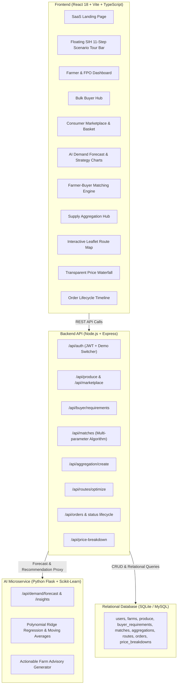

# 🌱 KisanSetu — AI-Powered Direct Farm-to-Market Operating System

> **"From Farm Supply to Market Demand — Connected Intelligently."**  
> *A SaaS-grade platform connecting farmers and FPOs directly with bulk institutional buyers and consumers with AI demand forecasting, multi-farmer supply aggregation, and optimized cold-chain logistics.*

---

## 🚀 Live Services & Quick Links

- **Frontend Web App**: [http://localhost:3000](http://localhost:3000)
- **Backend REST API**: [http://localhost:5000/api](http://localhost:5000/api)
- **AI Forecasting Microservice**: [http://localhost:5001/health](http://localhost:5001/health)

---

## 🌾 Problem Statement

Traditional agricultural supply chains in India suffer from acute structural fragmentation:
1. **Multi-Tier Intermediaries**: Produce passes through 4–6 speculative middlemen (Village Trader ➔ Mandi Commission Agent ➔ Regional Wholesaler ➔ Sub-distributor ➔ Retailer).
2. **Depressed Farmer Realization**: Smallholder farmers receive as little as 30–45% of the consumer price.
3. **Zero Demand Visibility**: Lack of forward demand signals causes distress harvesting and severe local market gluts.
4. **Logistics & Perishability Loss**: Uncoordinated transport without temperature control leads to 25–30% transit loss.
5. **Volume Incompatibility**: Smallholder farmers producing 200–500 kg lots cannot independently service institutional bulk buyers (hotels, supermarkets) requiring 1,000+ kg consignments.

---

## 💡 The KisanSetu Solution

KisanSetu operates an end-to-end intelligent farm-to-market workflow:

```
FARMER / FPO
     ↓ (Lists Produce e.g., 500 kg Grade-A Tomato @ ₹28/kg)
SUPPLY DATABASE
     ↓ (Indexed across Nashik, Pune & Western Maharashtra clusters)
AI DEMAND FORECAST
     ↓ (Scikit-Learn Polynomial Ridge Regression predicts +21% surge)
BUYER MATCHING ENGINE
     ↓ (Pairs 1,000 kg Bulk Order with Farmer A 500kg, Farmer B 300kg, Farmer C 200kg)
SUPPLY AGGREGATION
     ↓ (Consolidates multi-farmer lots at regional cluster hub)
ROUTE OPTIMIZATION
     ↓ (Leaflet map: 42 km cluster pickups, 1 hr 35 min, ₹2,850 logistics cost)
DELIVERY & TRANSPARENT PRICE BREAKDOWN
     ↓ (Farmer gets ₹27/kg [84.4%], Buyer landed cost ₹32/kg vs ₹41 traditional)
```

---

## 🏛️ System Architecture



---

## 🛠️ Technology Stack

| Layer | Technology | Purpose |
|---|---|---|
| **Frontend** | React 18, Vite, TypeScript | Ultra-responsive UI, instant HMR, type safety |
| **Design System** | Custom Vanilla CSS Tokens | Warm agricultural green (`#15803d`), harvest yellow (`#f59e0b`), cream background (`#faf8f5`) |
| **Icons & Maps** | Lucide React, Leaflet.js | Modern SVG iconography and interactive route geometry |
| **Data Viz** | Recharts | Multi-line time series demand and price waterfall distribution |
| **Backend** | Node.js, Express.js | High-throughput REST API server |
| **Database** | SQLite3 (Relational) | Zero-configuration relational database with pre-populated Maharashtra seed data |
| **AI / ML** | Python, Flask, Pandas, NumPy, Scikit-learn | Time-series polynomial regression, trend slope analysis, and actionable farm advisories |

---

## 👥 4 User Roles & Demo Credentials

| Role | Demo Name | Email | Password | Primary Action |
|---|---|---|---|---|
| **Farmer** | Ramesh Patil | `farmer@kisansetu.in` | `password123` | Add produce, view AI demand, track earnings |
| **Bulk Buyer** | Taj Hospitality Group | `buyer@kisansetu.in` | `password123` | Post 1,000 kg order, run matching, trigger aggregation |
| **FPO** | Sahyadri Agri Producer Co. | `fpo@kisansetu.in` | `password123` | Aggregate member lots, oversee cluster QA |
| **Consumer** | Priya Sharma | `consumer@kisansetu.in` | `password123` | Direct farm shopping, transparent basket breakdown |

> 💡 *Use the 1-Click Role Switcher dropdown in the top navigation bar to switch personas seamlessly without typing.*

---

## 🎬 11-Step SIH Demonstration Scenario

The application includes an **interactive floating Scenario Bar** that guides evaluators step-by-step through the core workflow:

1. **STEP 1 — Farmer Identity**: Sign in as Ramesh Patil (Nashik Farmer). Observe the agricultural command center.
2. **STEP 2 — List Fresh Harvest**: Click "+ Add Fresh Produce". Enter 500 kg Grade-A Tomato from Nashik at ₹28/kg.
3. **STEP 3 — Supply Database**: Observe the new inventory lot immediately reflected in the live database.
4. **STEP 4 — AI Demand Forecasting**: Open "What Buyers Need (AI)". Observe **+21% demand surge**, 87% confidence, and the actionable directive: *"Consider increasing Grade-A tomato supply by approximately 350–400 kg"*.
5. **STEP 5 — Bulk Buyer Requirement**: Switch to Bulk Buyer (*Taj Hospitality Group*). Broadcast a 1,000 kg Grade-A Tomato requirement for Mumbai.
6. **STEP 6 — AI Supply Matching Engine**: Open Matching Engine. System matches 3 farmers:
   - Farmer A (*Ramesh Patil - Nashik*): 500 kg @ ₹28/kg (94% match)
   - Farmer B (*Suresh Shinde - Nashik*): 300 kg @ ₹27/kg (89% match)
   - Farmer C (*Vikas Gaikwad - Pune*): 200 kg @ ₹29/kg (84% match)
   - **Total**: 1,000 kg matched (100% fulfilled).
7. **STEP 7 — Supply Aggregation**: Click "Create Aggregated Order". System combines 3 farmers into a single consolidated purchase order at weighted average ₹27.90/kg.
8. **STEP 8 — Logistics Planning**: Review pickup points in Nashik and Pune, Reefer truck allocation (Tata 407 1.5T).
9. **STEP 9 — Route Optimization Map**: Open interactive Leaflet Map. View clustered pickups (Nashik ➔ Pune ➔ Mumbai), **42 km cluster distance, 1 hr 35 min travel time, ₹2,850 logistics cost**.
10. **STEP 10 — Transparent Price Breakdown**: Open Price Breakdown.
    - **Buyer Pays**: ₹32/kg
    - **Farmer Receives**: ₹27/kg (84.4%)
    - **Aggregation & QC**: ₹1/kg
    - **Cold-Chain Logistics**: ₹2/kg
    - **KisanSetu Platform**: ₹1/kg
    - **Handling**: ₹1/kg
11. **STEP 11 — Order Tracking Lifecycle**: Click "Advance Lifecycle Stage" to progress through *Placed ➔ Matched ➔ Aggregated ➔ Route Planned ➔ Picked Up ➔ In Transit ➔ Delivered*.

---

## ⚡ Local Setup & Execution

### 1. Prerequisites
- **Node.js**: v18+ 
- **Python**: v3.10+ (with pip)

### 2. Quick Start
From the project root:

```bash
# Terminal 1: Start Python AI Microservice (Port 5001)
cd ai-service
pip install -r requirements.txt
python app.py

# Terminal 2: Start Node.js Backend API (Port 5000)
cd backend
npm install
npm start

# Terminal 3: Start Vite Frontend (Port 3000)
cd frontend
npm install
npm run dev
```

### 3. Run Automated 11-Step Verification Test
```bash
cd backend
node test_e2e.js
```

---

## 📊 Transparent Economics Comparison

| Metric | Traditional APMC Chain | KisanSetu Direct Model | Impact |
|---|---|---|---|
| **Farmer Payout** | ₹19.40 / kg | **₹27.00 / kg** | **+39.2% higher farmer income** |
| **Middleman Cut** | ₹14.60 / kg (speculative) | **₹0.00** | 100% eliminated |
| **Operational Costs** | ₹7.00 / kg (untracked) | **₹5.00 / kg** (audited) | Quality QC + Reefer transit |
| **Buyer Landed Cost** | ₹41.00 / kg | **₹32.00 / kg** | **-21.9% lower buyer cost** |
| **Post-Harvest Loss** | ~25–30% | **< 4%** | Cold-chain route optimization |

---

## 📜 License & Acknowledgments
Developed for Smart India Hackathon (SIH 2026).  
*Dedicated to the hardworking farmers of Maharashtra and India.*
